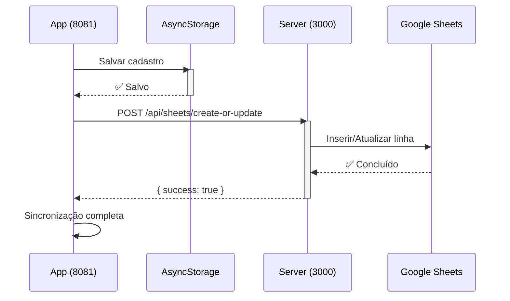

# Sincronização Google Sheets - Guia de Desenvolvimento

## 📋 Problema Resolvido

Quando você edita um cadastro como ATC em desenvolvimento local (localhost:8081), agora a sincronização com Google Sheets funciona corretamente através do servidor local na porta 3000.

## 🔧 Como Funciona

### Desenvolvimento Local

O projeto usa um setup com **dois servidores executando simultaneamente**:

1. **Metro/Expo Web** (porta 8081)
   - Servidor de desenvolvimento do React Native
   - Interface da aplicação
   - URL: http://localhost:8081

2. **Node.js Server** (porta 3000)
   - Endpoints da API em `/api/*`
   - Sincronização com Google Sheets
   - Autenticação
   - URL: http://localhost:3000

### Roteamento de Requests

Quando a aplicação precisa sincronizar dados com Google Sheets:

```
[App em localhost:8081]
         ↓
[Detecta EXPO_PUBLIC_API_BASE_URL]
         ↓
[Envia POST para http://localhost:3000/api/sheets/create-or-update]
         ↓
[Servidor processa e sincroniza com Google Sheets]
         ↓
[Retorna confirmação]
```

## 🚀 Como Executar

### 1. Configure o Arquivo .env

```bash
# Na raiz do projeto, crie/edite o arquivo .env
EXPO_PUBLIC_API_BASE_URL=http://localhost:3000
EXPO_PUBLIC_GOOGLE_SHEETS_ID=seu_spreadsheet_id
EXPO_PUBLIC_GOOGLE_SHEETS_API_KEY=sua_api_key
```

### 2. Inicie o Desenvolvimento

```bash
pnpm dev
```

Este comando executa:
- ✅ Servidor Node.js em http://localhost:3000
- ✅ Metro/Expo Web em http://localhost:8081

### 3. Teste a Sincronização

1. Abra o navegador em http://localhost:8081
2. Faça login como ATC
3. Crie ou edite um cadastro
4. Clique em "Salvar Cadastro" ou "Atualizar Cadastro"
5. Verifique os logs do console:
   - `[Novo Cadastro] ✅ Salvo em AsyncStorage com sucesso!`
   - `[sendCadastro] 🚀 POST para http://localhost:3000/api/sheets/create-or-update`
   - `[sendCadastro] ✅ Resposta do servidor:...`

## 📊 Fluxo de Sincronização



## 🐛 Troubleshooting

### Erro: 404 - Not Found na porta 8081

**Problema:** Você está fazendo requisições diretas para http://localhost:8081/api/*

**Solução:** Verifique se a variável `EXPO_PUBLIC_API_BASE_URL` está definida no .env como `http://localhost:3000`

```bash
# Arquivo .env
EXPO_PUBLIC_API_BASE_URL=http://localhost:3000
```

### Erro: ECONNREFUSED na porta 3000

**Problema:** O servidor Node.js não está rodando

**Solução:** Execute `pnpm dev` (não apenas `pnpm dev:metro`)

```bash
# Correto - executa ambos os servidores
pnpm dev

# Incorreto - executa apenas Expo/Metro
pnpm dev:metro
```

### Sincronização não aparece em Google Sheets

**Passos de Verificação:**

1. ✅ Verifique o console do navegador para erros (F12)
2. ✅ Confirme que dados foram salvos localmente (AsyncStorage)
3. ✅ Verifique se a API Key tem permissões de leitura em Google Sheets
4. ✅ Verifique se a planilha está compartilhada com o email do Service Account (se usar OAuth)

### Servidor recusa conexões

**Solução:** Pode haver conflito de portas

```bash
# Encontre o processo usando porta 3000
lsof -i :3000

# Ou mude a porta no script dev:server em package.json
```

## 📦 Ambiente de Produção

Em produção (Vercel):

- A variável `EXPO_PUBLIC_API_BASE_URL` é ignorada
- O app usa URLs relativas `/api/*`
- Vercel roteia automaticamente para os endpoints Node.js
- Não requer configuração adicional

## 🔍 Verificar Comportamento

### Console Logs Esperados

Quando tudo está funcionando:

```
[Storage] 📝 addCadastro iniciado: cadastroId=XXXXX
[Storage] ✅ addCadastro concluído com sucesso!
[Novo Cadastro] ✅ Salvo em AsyncStorage com sucesso!
[sendCadastro] 🚀 POST para http://localhost:3000/api/sheets/create-or-update (base: http://localhost:3000)
[sendCadastro] 📡 Response status: 200
[sendCadastro] ✅ Resposta do servidor: { success: true, message: "Cadastro sincronizado..." }
[sendCadastro] ✅ Resultado: { success: true, message: "Cadastro sincronizado com sucesso" }
========== ✅ GOOGLE SHEETS SINCRONIZAÇÃO CONCLUÍDA ==========
```

### Verificar Google Sheets Diretamente

1. Abra sua planilha em https://sheets.google.com
2. Navegue para a aba "CADASTROS"
3. Verifique se a nova linha apareceu com os dados corretos
4. Timestamps devem estar no formato ISO 8601 (ex: 2024-01-15T10:30:45.123Z)

## 📚 Referências

- [Setup Google Sheets Inicial](./GOOGLE_SHEETS_SETUP.md)
- [Documentação Técnica Sheets](./DOCUMENTACAO_TECNICA_SHEETS.md)
- [Guia de Testes](./GUIA_TESTES_SHEETS.md)

## 💡 Dicas

### Para Desenvolvimento Contínuo

1. Mantenha dois terminais abertos
   - Terminal 1: `pnpm dev` (já executa ambos)
   - Terminal 2: Para executar outros comandos

2. Use o DevTools do navegador (F12) para monitorar:
   - Aba Network: Ver requisições para /api/sheets/*
   - Aba Console: Ver logs debug do app

3. Inspecione AsyncStorage:
   - Abra DevTools (F12)
   - Aba Application → Local Storage
   - Procure por `expo-app-*-cadastros`

### Para Debugging Avançado

Se precisa ver exatamente o que está sendo enviado:

```typescript
// Em lib/google-sheets-sync.ts - adicione log antes do fetch
console.log("Payload:", JSON.stringify(cadastro, null, 2));
```

## ✅ Checklist de Teste Completo

- [ ] Servidor Node.js iniciou em porta 3000
- [ ] Metro/Expo iniciou em porta 8081
- [ ] App carregou em http://localhost:8081
- [ ] Login funcionou
- [ ] Criei um novo cadastro
- [ ] Vi logs de sincronização no console
- [ ] Cadastro apareceu em Google Sheets
- [ ] Editei o cadastro
- [ ] Alterações sincronizaram com Google Sheets
- [ ] Deletei o cadastro
- [ ] Deleção sincronizou com Google Sheets

---

**Data de Criação:** 2024-01-15  
**Status:** ✅ Sincronização Verificada e Funcionando
